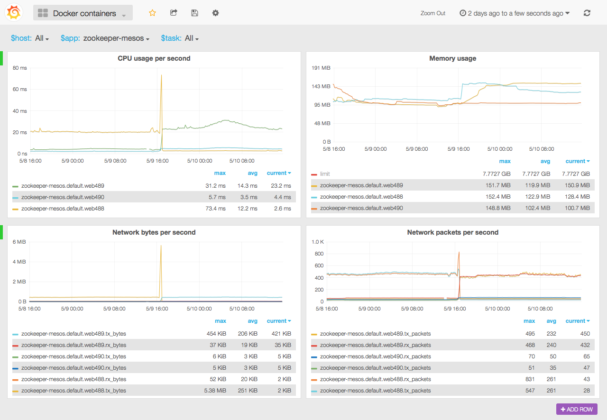

# Collect docker container resource usage

This is collectd plugin and docker image to collect resource usage
from docker containers. Resource usage collected from `docker stats` API
and sent to graphite installation.

Yu have to add `collectd_app` label or `COLLECTD_APP` env varialbe
with the application name to your containers to make it visible in graphite.

Containers can be added and removed on the fly, no need to restart collectd.

## Reported metrics

Metric names look line this:

```
collectd.<host>.docker_stats.<app>.<type>.<metric>
```

Gauges:


* CPU
    * `cpu.user`
    * `cpu.system`
    * `cpu.total`

* Memory overview
    * `memory.limit`
    * `memory.max`
	* `memory.usage`

* Memory breakdown
	* `memory.active_anon`
    * `memory.active_file`
    * `memory.cache`
    * `memory.inactive_anon`
    * `memory.inactive_file`
    * `memory.mapped_file`
    * `memory.pg_fault`
    * `memory.pg_in`
    * `memory.pg_out`
    * `memory.rss`
    * `memory.rss_huge`
    * `memory.unevictable`
    * `memory.writeback`

* Network (bridge mode only)
    * `net.rx_bytes`
    * `net.rx_dropped`
    * `net.rx_errors`
    * `net.rx_packets`
    * `net.tx_bytes`
    * `net.tx_dropped`
    * `net.tx_errors`
    * `net.tx_packets`

## Grafana dashboard

Grafana 2 [dashboard](grafana2.json) is included.



#### Graphite metrics extracted from the dashboard

* CPU usage

```
aliasByNode(scaleToSeconds(derivative(collectd.*.docker_stats.$app.gauge.cpu.total), 1), 3, 1)
```

* Memory limit

```
alias(averageSeries(collectd.*.docker_stats.$app.gauge.memory.limit), 'limit')
```

* Memory usage

```
aliasByNode(collectd.*.docker_stats.$app.gauge.memory.usage, 3, 1)
```

* Network bytes per second tx

```
aliasByNode(scaleToSeconds(derivative(collectd.*.docker_stats.$app.gauge.net.tx_bytes), 1), 3, 1, 6)
```

* Network bytes per second tx

```
aliasByNode(scaleToSeconds(derivative(collectd.*.docker_stats.$app.gauge.net.rx_bytes), 1), 3, 1, 6)
```

* Network packets per second tx

```
aliasByNode(scaleToSeconds(derivative(collectd.*.docker_stats.$app.gauge.net.tx_packets), 1), 3, 1, 6)
```

* Network packets per second rx

```
aliasByNode(scaleToSeconds(derivative(collectd.*.docker_stats.$app.gauge.net.rx_packets), 1), 3, 1, 6)
```

## Running

Minimal command:

```
docker run -d -v /var/run/docker.sock:/var/run/docker.sock \
    GRAPHITE_HOST=<graphite host> -e  COLLECTD_HOST=<colllectd host> \
    bobrik/collectd-docker
```

### Environment variables

* `COLLECTD_HOST` - host to use in metric name.
* `COLLECTD_INTERVAL` - metric update interval in seconds, defaults to `10`.
* `GRAPHITE_HOST` - host where carbon is listening for data.
* `GRAPHITE_PORT` - port where carbon is listening for data, `2003` by default.
* `GRAPHITE_PREFIX` - prefix for metrics in graphite, `collectd.` by default.

Note that this docker image is very minimal and libc inside does not
support `search` directive in `/etc/resolv.conf`. You have to supply
full hostname in `GRAPHITE_HOST` that can be resolved with nameserver.

## License

MIT
